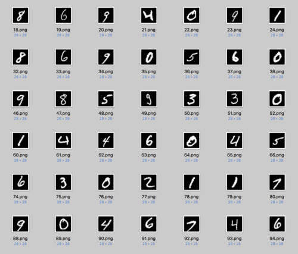

# Neural Network Play

## MNIST Dataset
It's a pretty cool dataset of 28x28 pixel PNG images of single handwritten digits.
There are 60,000 images and labels (in a separate text file).

## MNIST EXTRACTOR
Not my code. It's used to extract 'regular' PNG images and labels from the original format (not standard).
The images are int the _'./images/'_ directory. The labels are in the _'./labels.txt'_ file.
 
## Scikit Learn
Sklearn is a data science library which includes some neural network implementation

## SKLEARN DIGITS
It looks like it's a downsampled version of the original dataset, also with fewer samples. 

## Test Images
I've created some images of my own to test against and try to get them classified.

## Results
Some are pretty easy to get classified (e.g '1'), no such success for others. 
Among other reasons, it's because I tried to stick with the very basic model to later test my own model against.

## Perceptron Implementation
__TODO__